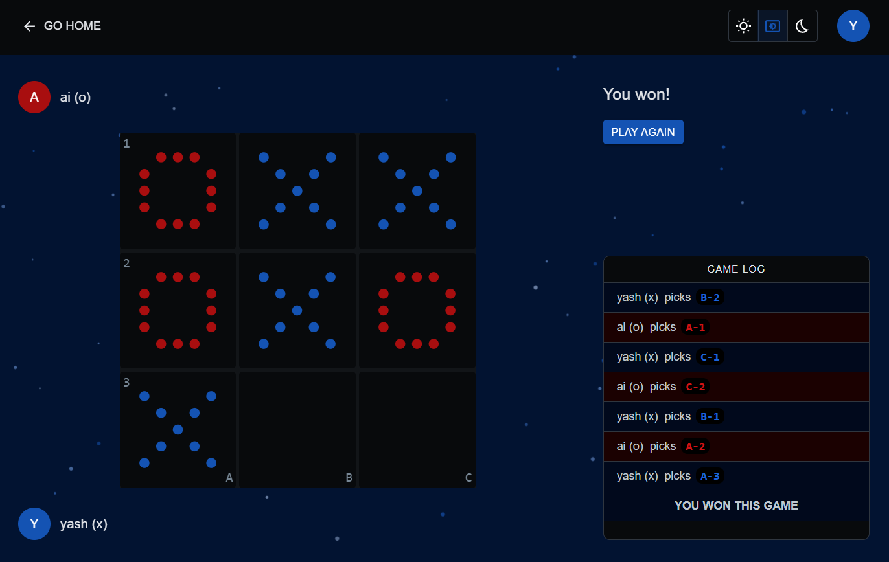

# ❌⭕ Play Tic Tac Toe with Friends — or AI!

Challenge your friends on the same Wi-Fi or test your skills against AI.

---

## ⚡ TL;DR

If you just want to dive in and start playing, run:

```bash
npx @khelo/tic-tac-toe@latest
```

No setup required. Just play!



---

## 🕹️ Features

- ✅ **Multiplayer** on the same Wi-Fi / LAN — no internet required
- 🤖 **Single-player** mode vs. AI (Easy / Medium / Hard)
- 🏠 **Create or join rooms** using a simple **PIN**
- 💬 **Chat with other players** during multiplayer games
- 🔁 **Instant rematch** — with friends or AI
- 🌓 **Dark & Light modes** — switch anytime

---

## 👯‍♂️ Multiplayer Mode

- One player runs the game to **host** the server
- Other players on the same Wi-Fi or LAN will **automatically find the host**
- Create a room or join using a **PIN**
- Chat with other players during the game using the in-game chat box
- Once the game ends, hit **Rematch** to keep playing!

---

## 🤖 Play vs. AI

Want to practice or play solo?

- Pick your challenge:
  - 🟢 Easy
  - 🟡 Medium
  - 🔴 Hard
- Play as many rounds as you like (just hit **Rematch**)

---

## 🌙 Light & Dark Mode

Customize your experience with theme options:

- 🌞 **Light Mode** – Bright and clean look
- 🌚 **Dark Mode** – Easy on the eyes, especially at night
- 🖥️ **System Theme** – Automatically matches your device's theme

Switch anytime from the settings menu.

---

## 🏁 Start Playing Now

```bash
npx @khelo/tic-tac-toe@latest
```

No installation. No signup. Just classic Tic Tac Toe — multiplayer or solo.  
Have fun, and may the best ❌ or ⭕ win!
